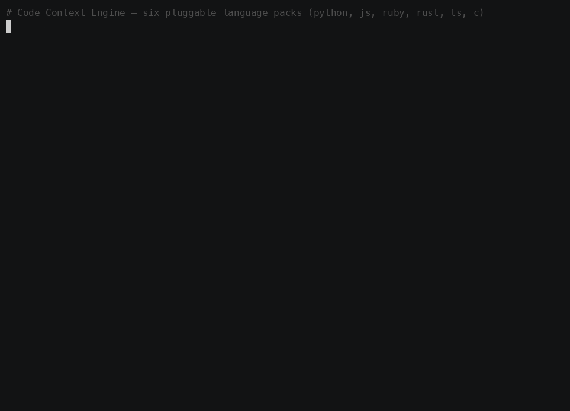
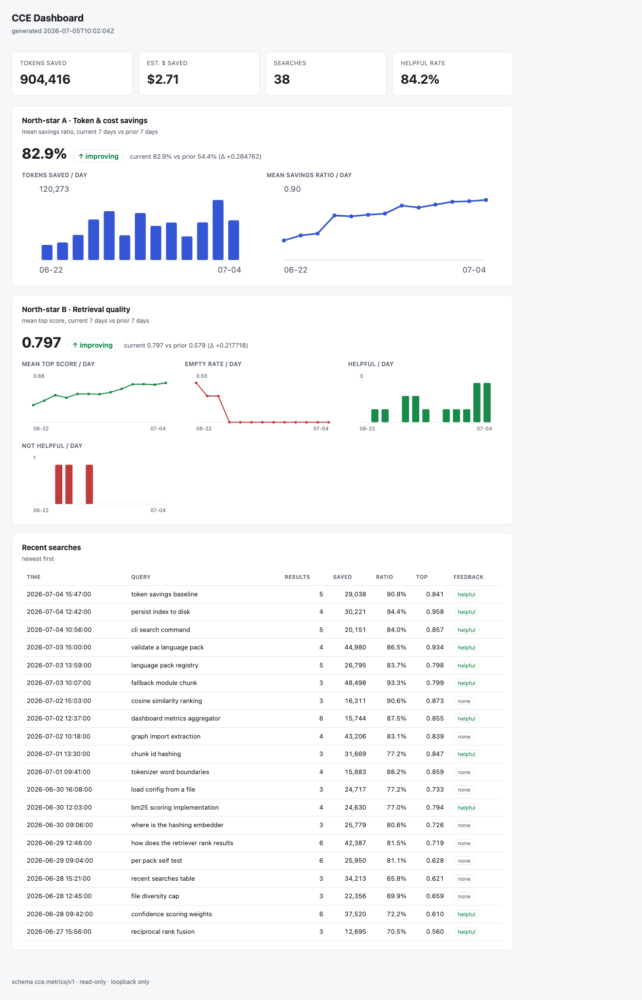

# Code Context Engine (CCE) — Rust

A local command-line tool that indexes a source-code repository so a program (or
an LLM) can **search for the most relevant code snippets** instead of reading
whole files. `cce` walks a directory, AST-chunks each file with tree-sitter,
embeds every chunk, and stores a vector + keyword index on disk as JSON. Queries
are answered with hybrid **vector + BM25** retrieval fused by Reciprocal Rank
Fusion.

Since **v2.0** language support is a set of pluggable **language packs**: the
core engine holds zero language-specific knowledge, and six packs ship in the box
— **Python, JavaScript, Ruby, Rust, TypeScript, and C** (see
[Supported languages](#supported-languages)). Since **v2.2** it can also treat a
directory of related codebases as one searchable **workspace** while each member
stays isolated (see [Workspaces / ecosystems](#workspaces--ecosystems)). Since
**v2.5** it ships the **[Savings Layers](#token-savings--honestly)** — compact-by-
default retrieval with expand-on-demand, output/grammar/memory/summarization
layers, nine agent-facing MCP tools, and a `cce savings` ledger that reports token
savings **honestly** (vs a full-file baseline, not your real end-to-end agent cost).

```
index a directory → walk → AST-chunk → embed → store (vectors + BM25 + import graph)
search a query    → vector + BM25 + RRF fusion → confidence blend → path penalty
                    → per-file diversity cap → optional import-graph expansion → top-K
```

## Provenance: a clean-room experiment

This is a **clean-room reimplementation built test-first** from a single
specification, [`SPEC.md`](SPEC.md) (SPEC v1.0), with no reference to any other
implementation. It is an experiment in whether a precise spec can act as the
program. A sibling implementation in Ruby was built from the *identical* spec and
lives at **[davidslv/cce-ruby](https://github.com/davidslv/cce-ruby)** — the two
are conformance-compatible on the same corpus (see [Conformance](#conformance)).
**v2.0** evolved both implementations, from [`SPEC-V2.md`](SPEC-V2.md), into the
pluggable language-pack architecture — again test-first and independently.

The write-up of the experiment:
[**"The spec was the program"**](https://davidslv.uk/2026/07/05/the-spec-was-the-program.html).

- Repository: <https://github.com/davidslv/cce-rust>
- Ruby sibling: <https://github.com/davidslv/cce-ruby>
- Author / sole maintainer: **David Silva** ([@davidslv](https://github.com/davidslv), <https://davidslv.uk>)

## Walkthrough



▶ **Interactive version:** open [`docs/presentation/index.html`](docs/presentation/index.html)
in a browser — a self-contained, autoplaying terminal cast (no dependencies, no network).

## Installation & environment setup

`cce` is a single Rust binary. The tree-sitter crates compile their C grammars
from source, so building it needs a stable Rust toolchain and a working C
compiler. **There are no other system libraries** — the index is plain JSON on
disk, so there is no database (no SQLite) to install.

### Fastest: a prebuilt release binary (no toolchain needed)

Every version is published on the [Releases page](https://github.com/davidslv/cce-rust/releases)
as tarballs for macOS (Apple Silicon + Intel) and Linux (x86_64 + arm64), with a
`SHA256SUMS` to verify. Grab the one for your platform:

```bash
# Example: macOS Apple Silicon (adjust the version + target for your machine)
curl -LO https://github.com/davidslv/cce-rust/releases/latest/download/SHA256SUMS
curl -LO "https://github.com/davidslv/cce-rust/releases/latest/download/cce-v$(curl -s https://api.github.com/repos/davidslv/cce-rust/releases/latest | grep -m1 tag_name | cut -d'"' -f4 | tr -d v)-aarch64-apple-darwin.tar.gz"
shasum -a 256 --check --ignore-missing SHA256SUMS
tar xzf cce-v*-aarch64-apple-darwin.tar.gz
sudo mv cce-v*/cce /usr/local/bin/    # or anywhere on your PATH
cce --version
```

git + git-LFS are still needed for CCE Sync (see below); everything else works
with just the binary. To build from source instead:

### macOS

```bash
# 1. Rust (stable) via rustup
curl --proto '=https' --tlsv1.2 -sSf https://sh.rustup.rs | sh
source "$HOME/.cargo/env"

# 2. A C toolchain for the tree-sitter grammars
xcode-select --install    # Xcode Command Line Tools (clang, make)

# 3. git + git-LFS (only needed for CCE Sync; see below)
brew install git git-lfs
git lfs install

# 4. Build and test
git clone https://github.com/davidslv/cce-rust
cd cce-rust
cargo build --release     # binary at target/release/cce
cargo test                # confirm a green build
```

### Ubuntu / Debian

```bash
# 1. Rust (stable) via rustup
curl --proto '=https' --tlsv1.2 -sSf https://sh.rustup.rs | sh
source "$HOME/.cargo/env"

# 2. A C toolchain for the tree-sitter grammars
sudo apt-get update && sudo apt-get install -y build-essential

# 3. git + git-LFS (only needed for CCE Sync; see below)
sudo apt-get install -y git git-lfs
git lfs install

# 4. Build and test
git clone https://github.com/davidslv/cce-rust
cd cce-rust
cargo build --release     # binary at target/release/cce
cargo test                # confirm a green build
```

### Install the binary on your PATH

```bash
cargo install --path .    # installs `cce` into ~/.cargo/bin
cce --version             # prints the version you built (see CHANGELOG.md)
```

### Optional: the semantic embedder (Ollama)

The default **hashing** embedder needs no setup and makes **no network calls**.
A semantic embedder is available if you want model-based vectors — it is
entirely opt-in:

```bash
# Install Ollama (https://ollama.com), then pull the embedding model:
ollama pull nomic-embed-text
```

`cce` talks to a local Ollama server over `localhost` HTTP only when you pass
`--embedder ollama`. If Ollama is unreachable it prints a warning and falls back
to the hash embedder, so indexing never fails because of it.

## Usage

The binary is `cce`. Examples below assume `target/release/cce` is on your PATH
(or substitute the full path).

### Index a directory

```bash
$ cce index ./src
Indexed ./src
  files indexed     : 14
  files skipped     : 0
  sensitive skipped : 0
  total chunks      : 14
  embedder          : hash
  store             : ./src/.cce/index.json
  elapsed           : 0.004s
```

By default the store is written to `<dir>/.cce/index.json`. Override it with
`--store <path>`, or select the embedder with `--embedder hash|ollama`.

#### Secret protection (secure by default)

Since v2.1, indexing is **secret-safe by default** — you do not have to opt in.
Two layers keep credentials out of the on-disk store:

- **Layer 1 — sensitive files are never read.** Files whose name marks them as
  secret material are skipped before they are opened and tallied on the
  `sensitive skipped` line: private-key/cert files (`*.pem`, `*.key`, `*.p12`,
  `*.pfx`, `*.keystore`, `*.jks`, `*.ppk`, `*.der`, `*.asc`), credential dumps
  (`credentials.*`, `secrets.*`, `.netrc`, `.pgpass`, `.htpasswd`, `.dockercfg`,
  `kubeconfig`, `id_rsa`/`id_dsa`/`id_ecdsa`/`id_ed25519`), and `.env` /
  `.env.*` — **except** safe templates ending `.example`, `.sample`, `.template`,
  or `.dist`, which are indexed normally.
- **Layer 2 — secrets are redacted before chunking.** In the files that *are*
  indexed, high-confidence secrets (private-key blocks; AWS, GitHub, Slack,
  Stripe, OpenAI, Anthropic, and Google keys; JWTs; and guarded `key = value`
  assignments) are replaced with `[REDACTED:<LABEL>]` **before** the content is
  chunked, embedded, or stored — so the raw value never reaches `.cce/`.
  Documentation placeholders such as `API_KEY="your-api-key-here"` are left alone.

To disable both layers for a run (and index sensitive files and raw secrets
verbatim), pass `--allow-secrets`; `cce` prints a warning when you do.

```bash
$ cce index ./src --allow-secrets     # protection OFF — you own the risk
```

### Search

`search` reopens the store in a fresh process and never re-embeds the corpus.

```bash
$ cce search "how does the hashing embedder work" --dir ./src --top-k 5 --no-graph
 1. [0.845094] config.rs:1-111 (module)
    //! # config — normative constants and runtime configuration
 2. [0.844081] bench.rs:1-278 (module)
    //! # bench — the benchmark runner behind `cce bench`
 3. [0.840160] vector_store.rs:1-75 (module)
    //! # vector_store — exact brute-force cosine ranking
 4. [0.827884] lib.rs:1-31 (module)
    //! # Code Context Engine (CCE) — library root
 5. [0.809263] embedder.rs:1-321 (module)
    //! # embedder — deterministic hashing embedder, cosine, and rounding
```

Add `--json` for machine-readable output:

```bash
$ cce search "cosine similarity ranking" --dir ./src --top-k 3 --no-graph --json
{
  "query_id": "3f9a1c0b7e21",
  "results": [
    {
      "chunk_id": "2d5d9159a130943e",
      "chunk_type": "module",
      "kind": "module",
      "end_line": 75,
      "file_path": "vector_store.rs",
      "rank": 1,
      "score": "0.852287",
      "start_line": 1
    }
  ]
}
```

Since v1.1 the `--json` body is an **object** with a top-level `query_id` (the id
of the recorded search event — see [Dashboard & observability](#dashboard--observability))
wrapping the `results` array. Human output prints the same id on a final
`query-id:` line. Pass `--no-metrics` to skip recording (then `query_id` is null).

Search flags: `--dir <dir>` (resolves `<dir>/.cce`) or `--store <path>`,
`--top-k N` (default 5), `--no-graph` (skip import-graph expansion), `--json`,
`--no-metrics`.

### A worked example (AST chunking)

Every supported language is chunked into its functions/classes. Index the bundled
multi-language sample corpus and search it — results carry both the coarse
`chunk_type` and the exact tree-sitter node `kind`:

```bash
$ cce index test/fixture/samples --store /tmp/s.cce
Indexed test/fixture/samples
  files indexed : 7
  files skipped : 0
  total chunks  : 21
  embedder      : hash

$ cce search "build the index store" --store /tmp/s.cce --top-k 3 --no-graph
 1. [0.79xxxx] rust.rs:3-5 (function/function_item)
    pub fn build_index() -> HashMap<String, u32> {
 2. [0.71xxxx] rust.rs:7-9 (class/struct_item)
    pub struct Store {
 3. [0.65xxxx] rust.rs:11-15 (class/impl_item)
    impl Store {
```

### Statistics

```bash
$ cce stats --store /tmp/s.cce
Store: /tmp/s.cce
  chunks         : 21
  files          : 7
  avg token/chunk: ...
  by language:
    c           : 3
    javascript  : 3
    plaintext   : 1
    python      : 3
    ruby        : 3
    rust        : 4
    typescript  : 4
  by kind:
    class_declaration   : 1
    function_definition : 2
    impl_item           : 1
    module              : 1
    struct_item         : 1
    ...
```

### Language packs

List the registered packs, or run the three-layer validators over every pack:

```bash
$ cce packs
Registered language packs (6):
  python       .py                      1 fn / 1 class types · grammar: ... node kinds
  javascript   .js,.jsx,.mjs,.cjs       4 fn / 1 class types · grammar: ... node kinds
  ruby         .rb                      2 fn / 2 class types · grammar: ... node kinds
  rust         .rs                      1 fn / 5 class types · grammar: ... node kinds
  typescript   .ts,.tsx                 4 fn / 3 class types · grammar: ... node kinds
  c            .c,.h                    1 fn / 3 class types · grammar: ... node kinds

$ cce packs --validate
[pack:python] ok
...
all 6 packs passed validation
```

Adding a language is: add one pack file, register it, and pass validation — no
core edits. See [`docs/adding-a-language.md`](docs/adding-a-language.md).

### Benchmark

Indexes a checked-out repository **whole** (exactly as `cce index`) and runs one
language's labeled query set, writing [`docs/BENCHMARKS.md`](docs/BENCHMARKS.md):

```bash
$ cce bench /path/to/sinatra --lang ruby --name "sinatra/sinatra@v4.1.1"
Benchmark complete (sinatra/sinatra@v4.1.1, ruby, commit 7b50a1b...):
  files/chunks : 287/1337
  index        : 0.167s (7990.0 chunks/s)
  latency      : p50 0.429ms  p95 0.549ms
  recall@5/@10 : 90.0% / 90.0%
  token savings: 72.6%
```

`--lang` selects only the query set and label — the whole repo is indexed either
way, so recall and token-savings match the Ruby sibling exactly. The four active
languages benchmarked are Ruby (sinatra), Rust (hyperfine), TypeScript (zustand),
and C (jq) — see [`docs/BENCHMARKS.md`](docs/BENCHMARKS.md).

### Conformance

Emits the cross-implementation conformance file over the seven-file sample corpus
— byte-identical across runs and designed to match the Ruby sibling. Each chunk
carries its `kind` (v2 shape):

```bash
$ cce conformance test/fixture/samples -o conformance.json
wrote conformance.json
```

## Dashboard & observability

Since v1.1, CCE keeps a small **persisted metrics log** so you can see whether
using it is *improving or degrading your experience over time*, from real data.
Every `cce search` and `cce index` appends one JSON line to
`<store-dir>/metrics.jsonl` (best-effort — a metrics failure never affects the
command), and `cce feedback` lets you rate a past result. A local, read-only web
dashboard visualizes two north-stars — **token/cost savings** and **retrieval
quality** — each trended current-vs-prior with an ↑ improving / ↓ degrading / →
flat indicator, plus a recent-searches table. (The base engine and
`conformance.json` are untouched by any of this.)

**Refreshed in v2.4.1** with four panels for the capabilities that landed since:
**agent-vs-human usage** (CLI vs MCP/agent searches), a **per-package breakdown**
(savings/searches/quality per workspace member), **index freshness** (indexed `sha`,
local-vs-`sync-pull` source), and **secret-safety** (the sensitive-files-skipped
count). Every panel is **purely log-derived**, so the dashboard makes **zero network
calls** (behind-remote lives in `cce sync status`); the metrics schema grew only by
adding fields, so old logs still parse.



```bash
# 1. Index and search as usual — events are recorded automatically.
$ cce index ./src
$ cce search "how does confidence scoring work" --dir ./src
 1. [0.83xxxx] retriever.rs:1-423 (module)
    //! # retriever — the hybrid retrieval pipeline
query-id: 3f9a1c0b7e21  ·  rate with: cce feedback 3f9a1c0b7e21 --helpful|--not-helpful

# 2. Rate that result (optional but powers the "quality" north-star).
$ cce feedback 3f9a1c0b7e21 --helpful --dir ./src
recorded feedback (helpful) for 3f9a1c0b7e21  [event a1b2c3d4e5f6]

# 3. Open the dashboard (loopback only, read-only, fully self-contained).
$ cce dashboard --dir ./src
cce dashboard: serving http://127.0.0.1:8787/  (loopback only, read-only)
```

The server binds `127.0.0.1` only, mutates nothing, and inlines all CSS/JS and
draws its own SVG charts — **no external network, CDN, or fonts**. It exposes
`GET /` (the page), `GET /api/metrics` (the aggregate JSON, recomputed per
request), and `GET /api/health`. Flags: `--dir DIR` / `--store PATH` /
`--metrics PATH` to locate the log, `--port N` (default 8787), `--price N` (USD
per 1M input tokens for the $-saved estimate, default 3.00), `--no-open`.

See [`docs/dashboard.md`](docs/dashboard.md) for the pipeline, event schema, and
the exact aggregation formulas.

## Workspaces / ecosystems

CCE can treat a directory of related codebases — a Rails app, its engines, and a
frontend under one root — as a single searchable **ecosystem**, while **each
member stays isolated in its own store** (SPEC-V2.2). Three ideas: members are
auto-detected into a reviewable `.cce/workspace.yml`; every member is indexed into
its own `<member>/.cce/index.json` (byte-identical to indexing it standalone); and
a federated search runs the standard hybrid retrieval over the **union** of the
members' chunks, tagging each result with its package and adding **cross-member
dependency edges** read from manifests.

Worked example — a generic ecosystem laid out as:

```
shop/
  app/                     Gemfile (gem "billing"), config/application.rb, app/models/charge.rb
  engines/
    billing/               billing.gemspec (name = "billing"), lib/billing.rb, lib/billing/engine.rb
  web/                     package.json (name = "web"), tsconfig.json, src/index.ts
```

```bash
# 1. Detect members → write shop/.cce/workspace.yml (reviewable, hand-editable).
cce workspace init shop
#   app      rails-app    app             · package app
#   billing  ruby-engine  engines/billing · package billing
#   web      typescript   web             · package web

# 2. Members + the detected cross-member edges.
cce workspace list shop
#   app -> billing  (via gemfile)

# 3. Index every member into its own store, then build the workspace graph.
cce index --workspace shop

# 4. Federated search over the union, scoped and labelled by package.
cce search "charge the customer" shop --workspace --package app,billing --json
#   → results carry {package, file_path (member-relative), …}; a top hit in `app`
#     expands into `billing` via the app→billing dependency edge.

# 5. Per-member stats and a federated dashboard (roll-up + by_package breakdown).
cce stats     --workspace shop
cce dashboard --workspace shop
```

`workspace.yml` (deterministic, members sorted by path):

```yaml
version: 1
name: shop
members:
  - name: app
    path: app
    type: rails-app
    package: app
  - name: billing
    path: engines/billing
    type: ruby-engine
    package: billing
  - name: web
    path: web
    type: typescript
    package: web
```

Absent `--workspace`, every command behaves exactly as before. See
[`docs/workspace.md`](docs/workspace.md) for the model, manifest format, detection
rules, federation semantics, and where the approach strains.

## CCE Sync — a distributed, offline-first cache (v2.3)

**Model: git remotes for the index.** Your local `.cce/` is authoritative; an
optional git-backed remote is a *content-addressed cache* you push to and pull
from. Because the index is deterministic (hash embedder), a cache for `repo@sha` is
**byte-identical** no matter who — or which language engine — built it. Sync is
**purely additive**: every existing command works with no remote, and a failed
push/pull never breaks local work.

Prerequisites: `git`, and `git-lfs` if you keep LFS on (the default) — see
[Installation](#installation--environment-setup). Only the **hash** embedder is
shareable; `cce sync push` refuses a non-hash index or a dirty working tree.

End-to-end walkthrough (real captured output; a bare `file://` repo stands in for
your cache repo — swap in an SSH/HTTPS URL for real use). The concrete commit `<sha>`
and absolute paths vary by environment; the **checksums and chunk counts are the
stable, reproducible values**.

```console
# 0. one-time: a cache repo (normally a real, empty git repo you can push to)
$ git init --bare -b main /srv/cache.git

# 1. configure the remote for your project (writes .cce/config, sets up the clone)
$ cce sync init --remote file:///srv/cache.git --repo-id github.com__acme__billing
Configured sync remote: file:///srv/cache.git
  git-LFS       : enabled (*.cce)
  repo_id       : github.com__acme__billing
  working clone : ~/.cce/sync/507cf2021d44e3f3
  config        : ./.cce/config

# 2. push the index for the committed HEAD (or let CI do it — see below)
$ cce sync push
Pushed github.com__acme__billing@7b9dec7dcbe86ca35b2b4ddeb8386d0595e3362f
  key      : hash/2.3/github.com__acme__billing/7b9dec7dcbe86ca35b2b4ddeb8386d0595e3362f.cce
  checksum : 18ca676d989dee00af072ad269c60e28af64441483613954132c530c4fb4ff05

# 3. a teammate (fresh clone at the same sha) pulls it — instantly
$ cce sync pull
Pulled github.com__acme__billing@7b9dec7dcbe86ca35b2b4ddeb8386d0595e3362f
  chunks   : 2
  checksum : 18ca676d989dee00af072ad269c60e28af64441483613954132c530c4fb4ff05
  store    : ./.cce/index.json
  tree     : matches — pulled index used as-is

# 4. (optional) paranoid re-check: re-index locally, confirm the checksum
$ cce sync verify
verify OK: github.com__acme__billing@7b9dec7dcbe86ca35b2b4ddeb8386d0595e3362f
  checksum : 18ca676d989dee00af072ad269c60e28af64441483613954132c530c4fb4ff05

# 5. search the pulled index — no local reindex needed
$ cce search "authenticate user password" --no-metrics
 1. [0.920470] src/auth.py:1-3 (function/function_definition)
    def login(user, password):
 2. [0.875340] src/pay.py:3-6 (function/function_definition)
    def charge(user, amount):
```

The pull checksum equals the push checksum, bit-for-bit — that is content
addressing. `cce sync status` shows the remote, the local cache sha, the remote
`--latest` pointer, and whether your working tree matches. `cce sync pull --latest`
grabs the newest sha CI pushed for `main`.

**CI (GitHub Actions):** index `main` and push on every merge with the ready-to-copy
[`docs/ci/cce-sync.yml`](docs/ci/cce-sync.yml). The token it uses needs **write**
access to the *cache* repo only; developers need only **read** to pull.

**Offline-first, always:** with no remote (or an unreachable one), `cce index`,
`cce search`, and `cce sync status` still work — `status` just reports the
local-only state. `--workspace` push/pull iterate the members, each keyed by its own
`repo_id@sha`.

See [`docs/sync.md`](docs/sync.md) for the artifact format (byte-exact,
cross-language), the content-address scheme, permissions guidance, and
troubleshooting; and [`docs/VERIFIED.md`](docs/VERIFIED.md) for the full cold-start
transcript.

## Use it with Claude Code (MCP) — v2.4

The whole point of indexing your code is for an **agent** to use it. `cce mcp` is a
[Model Context Protocol](https://modelcontextprotocol.io) server so Claude Code (or
any MCP client) calls CCE as a **first-class tool it auto-invokes** — instead of
reading and grepping whole files, the agent runs `context_search` and pays tokens
only for the handful of relevant chunks. `cce init` wires the editor up so it is
plug-and-play, and every search is logged to `.cce/metrics.jsonl`, so
`cce dashboard` proves the agent used it (and what it saved).

```bash
# 1. In your project: build the index, write .mcp.json + a CLAUDE.md block.
cce init .
#   CCE is wired up for Claude Code.
#     index     : built N chunk(s) from M file(s)
#     .mcp.json : ./.mcp.json (server "cce")
#     CLAUDE.md : ./CLAUDE.md (context_search guidance)

# 2. Restart your editor so it loads .mcp.json, then just ask a question:
#      "where is the password hashed?"
#    Claude Code calls the `context_search` tool and answers from the chunks it
#    returns — no whole-file reads.

# 3. Confirm it was used — the search shows up on the dashboard:
cce dashboard
```

`cce init` writes a minimal, idempotent [`.mcp.json`](https://modelcontextprotocol.io):

```json
{ "mcpServers": { "cce": { "command": "cce", "args": ["mcp", "--dir", "."] } } }
```

and a marker-bounded block in `CLAUDE.md` telling the agent to **prefer
`context_search` over Read/Grep**. Re-running `cce init` is safe — it merges, never
duplicating a server entry or the block.

**Nine tools** (identical names, schemas, and output in the Ruby and Rust engines),
in a fixed order. The three v2.4 tools plus the six v2.5 [Savings
Layers](#token-savings--honestly) tools — the core loop is **find → expand →
widen**: `context_search` returns **compact** chunks by default (each with a
`chunk_id`); `expand_chunk` reads a full body only when you need it:

| Tool | What it does |
|---|---|
| `context_search` | Ranked, **compact** code chunks (`file:line + kind + #chunk_id`) for a query, over the same hybrid vector + BM25 index as `cce search`. Logs a `search` event, returns a `query_id`. Args: `query` (required), `top_k` (8), `package`, `no_graph`, `max_tokens`, `detail` (signature\|compact\|full). |
| `index_status` | Whether the project is indexed, per-language/per-kind counts, and — if CCE Sync is configured — the source (local vs pulled), sha, and whether it is behind the remote. |
| `record_feedback` | Rate a prior result (`query_id`, `helpful`, optional `note`); appends a `feedback` event so the dashboard's quality signal reflects agent use. |
| `expand_chunk` | Read the **full** body / file / neighbours of a returned chunk by `chunk_id` (`scope`: body\|file\|neighbors). `body` recovers the exact full bytes. |
| `related_context` | Import-graph neighbours (imports **and** consumers) of a chunk, as compact entries, on demand. |
| `set_output_compression` | Dial THIS session's own answer terseness (`off`\|`lite`\|`standard`\|`max`); a session preference, not a CLAUDE.md rewrite. |
| `record_decision` | Remember a **validated** decision — secret-scrubbed, content-addressed, local-only (`.cce/memory.jsonl`, never pushed by Sync). |
| `session_recall` | Precision-filtered hybrid search over remembered decisions; returns high-confidence entries you choose to use, never an auto-injected blob. |
| `summarize_context` | A **deterministic, structured** digest of the session so far (files/chunks/queries/decisions) — not an LLM summary. |

See [`docs/mcp.md`](docs/mcp.md) for every input schema and worked output, and
[`docs/savings.md`](docs/savings.md) for the layers behind them.

**How to confirm the agent used it.** Two independent signals: the tool call is
visible in Claude Code's tool-call log, and every `context_search` is a `search`
event on `cce dashboard` (queries, counts, tokens saved). That is proof of *use*
and of *value*.

**Fresh, team-shared context via CCE Sync (optional).** `cce init --remote <cache>`
pulls the CI-built index (seconds, not a full local re-index) instead of indexing
locally, and if `sync.auto_pull` is on, `cce mcp` best-effort refreshes to the
canonical `main@sha` on startup. This is a **soft dependency** — with no remote
configured, MCP works fully on the local index, offline. See
[`docs/mcp.md`](docs/mcp.md) for the tool schemas, the workspace (`--workspace`)
flow, and the sync-freshness details.

## Token savings — honestly

Retrieval alone (returning chunks instead of files) does **not** reliably beat a
modern agent's own grep-and-read. The real savings come from **seven layers**, and
CCE reports them honestly. Since **v2.5** it ships all seven plus a measurement
ledger (full detail in [`docs/savings.md`](docs/savings.md)):

| # | Layer | What it does |
|---|---|---|
| L1 | **Retrieval** | Return ranked chunks, not whole files. |
| L2 | **Chunk compression** | AST-driven **compact** chunks — signature + doc + first line — the default; `detail: signature\|compact\|full`. |
| L3 | **Grammar** | Byte-pinned, filler-free result grammar; self-measured. |
| L4 | **Output compression** | A leveled `CLAUDE.md` block steers terse replies (`output.level`: off\|lite\|standard\|max, default standard); `set_output_compression` at runtime. |
| L5 | **Memory** | `record_decision` / `session_recall` — validated-only, precision-filtered, local, secret-scrubbed, never pushed by Sync. |
| L6 | **Turn summarization** | `summarize_context` — a deterministic structured session digest (not an LLM summary). |
| L7 | **Progressive disclosure** | `expand_chunk` / `related_context` — compact by default, **expand on demand**. |

**Compact by default, expand on demand.** `context_search` serves compact chunks
each carrying a `chunk_id`; the agent calls `expand_chunk(chunk_id)` for a full body
only when it needs one. `expand_chunk(scope=body)` recovers the exact bytes, so
compression never loses information.

**`cce savings` — the ledger.** Every `search` event records its per-layer token
deltas; `cce savings` sums them into the seven buckets and prints an **offline**
dollar estimate (embedded pricing, no network):

```bash
$ cce savings --dir ./src
CCE savings ledger  (vs full-file baseline — not your real end-to-end agent cost)
  ...
  layer                       saved_tokens   baseline_tokens
  retrieval                             56               404
  chunk_compression                     82               348
  grammar                              150               266
  ...
  total                                288              1018
  estimated $ saved: $0.00  (default-model input rate)
  This is the internal "vs full-file" figure, NOT your real agent cost.
  For the real end-to-end delta, run the A/B eval harness: see eval/README.md.
```

**The honest framing (read this).** Every figure is measured **vs a full-file
baseline** — the tokens you'd spend reading the *whole file(s)* the chunks came
from. That is **not** your real end-to-end agent cost, because a modern agent
greps and reads slices rather than whole files. There is **no "94%" headline
without that asterisk.** Real-world value is **workload-dependent**: biggest on
**large codebases with many cross-file queries and long sessions**, smallest on a
single-file locate where you already know the path. To measure the number that
actually matters — the real end-to-end delta of running your agent with CCE off vs
on — use the in-repo **A/B eval harness** (`cce eval`, correctness-gated and
cost-primary; see [`eval/README.md`](eval/README.md)), the honest counterpart to
the internal ledger. The token counter (`cce.tokens/v1` = `max(1, floor(bytes/4))`)
is a deterministic **estimator**, not a model tokenizer.

## Offline-first (verified)

**CCE is local-first: every core workflow runs with no network and no remote.**
With no sync remote configured, all of these work fully offline and are recorded as a
real offline cold-start run in [`docs/VERIFIED.md`](docs/VERIFIED.md):

| Command | Offline? | Notes |
|---|---|---|
| `cce index` | ✅ fully offline | walk → AST-chunk → hash-embed → write local JSON |
| `cce search` | ✅ fully offline | reopens the local store; no re-embedding of the corpus |
| `cce stats` | ✅ fully offline | reads the local store |
| `cce dashboard` | ✅ fully offline | loopback-only, read-only; inlines all CSS/JS/SVG; **every panel is purely log-derived, so it makes zero network calls** (behind-remote is answered by `cce sync status`) |
| `cce workspace` / `--workspace` | ✅ fully offline | detection, federated index/search/stats/dashboard |
| `cce mcp` | ✅ fully offline | serves the **local** index (nine tools) to the agent; auto-pull is a soft dependency that no-ops with no remote |
| `cce savings` / `cce eval` | ✅ fully offline | log-derived ledger + A/B aggregation; embedded pricing, no network |
| `cce feedback` / `cce conformance` / `cce packs` / `cce bench` | ✅ fully offline | pure local operations |

The **only** things that ever touch the network are, explicitly:

1. **The optional Ollama embedder** (`--embedder ollama`) — a `localhost` HTTP call;
   unreachable ⇒ it warns and falls back to the offline hash embedder.
2. **`cce sync push` / `cce sync pull`** — the git cache transport. Everything else,
   including reading a *previously* pulled index, is offline.
3. **Installing the binary** (`cargo install`, `git clone`) — a one-time step.

Everything else is fully offline by construction. The default test suite makes **no
network calls** (the metrics clock/id source are injected; dashboard tests bind an
ephemeral loopback port; sync tests use a `file://` bare remote).

## Best practices — CCE Sync & CCE MCP

**CCE Sync**

- **One sync repo per access boundary.** Anyone who can read the cache repo can read
  the indexed code's structure — scope the cache repo to the same audience as the
  source. Use a separate cache repo per team/trust boundary.
- **Make CI the canonical pusher.** Let a CI job index `main` and `cce sync push` on
  every merge ([`docs/ci/cce-sync.yml`](docs/ci/cce-sync.yml)); developers only ever
  **pull**. The CI token needs *write* to the cache repo only; developers need *read*.
- **`.gitignore` your `.cce/`.** The local store and metrics log are machine-local —
  keep them out of the source repo. A one-line `.gitignore` entry (`.cce/`) also keeps
  `cce sync push`'s clean-tree check from tripping on store churn.
- **Only the hash embedder is shareable.** `cce sync push` refuses a non-hash index or
  a dirty tree — a cache is content-addressed by commit, so it must be reproducible.
- **`cce sync verify` when in doubt.** It re-indexes locally and confirms the pulled
  checksum, byte-for-byte.

**CCE MCP**

- **Wire it once with `cce init`, then confirm via the dashboard.** After the agent
  runs, `cce dashboard`'s agent-vs-human panel shows the `mcp` searches — proof the
  agent used CCE and what it saved. That closes the loop.
- **Prefer `context_search` over Read/Grep** — the `CLAUDE.md` block `cce init` writes
  already steers the agent this way; keep it.
- **Use a workspace for an ecosystem, a single repo for one codebase.** `cce mcp
  --workspace` federates members; plain `cce mcp` serves one store. Match the mode to
  the tree.
- **Team-shared context: `cce init --remote <cache>`.** Pull the CI-built index in
  seconds instead of a full local re-index; turn on `sync.auto_pull` to have `cce mcp`
  refresh to `main@sha` on startup. It stays a soft dependency — offline still works.
- **Secret-safe by default.** Indexing skips sensitive files and redacts secrets before
  they reach the store (`--allow-secrets` opts out, loudly). The dashboard's
  secret-safety panel shows the skip count.

## Supported languages

Language support is a set of pluggable **language packs** (SPEC-V2). The core
chunker/importer references no language by name; each pack is one self-contained
file declaring its extensions, grammar, function/class node types, and import
rule, and each is guarded by three validator layers (`cce packs --validate`).

| Pack | Extensions | Chunks | Imports from |
|---|---|---|---|
| `python` | `.py` | functions, classes | `import`, `from … import` |
| `javascript` | `.js`, `.jsx`, `.mjs`, `.cjs` | functions, methods, arrows, classes | `import … from "x"` |
| `ruby` | `.rb` | methods, classes, modules | `require`, `require_relative` |
| `rust` | `.rs` | fns; struct/enum/trait/impl/union | `use` (first segment) |
| `typescript` | `.ts`, `.tsx` | functions, methods, class/interface/enum | `import … from "x"` |
| `c` | `.c`, `.h` | functions; struct/union/enum | `#include <…>` / `"…"` |

Any file no pack claims (or that a pack parses to zero symbols) becomes a single
whole-file `module` fallback chunk. Every chunk records the exact tree-sitter
node type in a `kind` field alongside the coarse `chunk_type`
(`function`/`class`/`module`). Adding a language is a one-file change —
[`docs/adding-a-language.md`](docs/adding-a-language.md).

## What's inside

- **AST-aware chunking** via tree-sitter through six pluggable language packs
  (Python, JavaScript, Ruby, Rust, TypeScript, C); a whole-file `module` fallback
  for every other language.
- **Pack validators** — structural, grammar-binding ("did you mean" node-kind
  suggestions), and behavioural self-test — surfaced by `cce packs --validate`.
- A **deterministic hashing embedder** (FNV-1a, SPEC §5.1), exact brute-force
  cosine, Lucene-form **BM25**, **Reciprocal Rank Fusion**, a confidence blend,
  a test/doc path penalty, a per-file diversity cap, and import-graph expansion —
  all with the exact SPEC constants.
- **On-disk JSON persistence**; `search`, `stats`, and `conformance` reopen the
  store in a fresh process.
- **Determinism** everywhere: scores are rounded to 6 decimals
  (round-half-away-from-zero) and ties break by `chunk_id` ascending (SPEC §5.3),
  so `cce conformance test/fixture/samples` is byte-identical across runs.

## Tests & coverage

```bash
cargo test                                                  # 416 tests
cargo clippy --all-targets --all-features -- -D warnings    # lint gate
cargo fmt --check                                           # format gate
```

The suite is **416 passing tests** (+1 `#[ignore]` Ollama integration test) and
measures **93.9% line coverage** via `cargo llvm-cov`. The default suite is
fully deterministic and makes no network calls — including the metrics subsystem,
whose clock and id source are injected and whose dashboard tests bind an
ephemeral loopback port. A CI test gate runs the three-layer validators over every
language pack, and a guard test asserts the core chunker names no language.

## Documentation

| Doc | What it covers |
|---|---|
| [`SPEC.md`](SPEC.md) | The normative base specification (v1.0) |
| [`DASHBOARD-SPEC.md`](DASHBOARD-SPEC.md) | The dashboard & observability addendum (v1.1) |
| [`SPEC-V2.md`](SPEC-V2.md) | The language-packs evolution spec (v2.0) |
| [`SPEC-V2.1.md`](SPEC-V2.1.md) | The secret-protection evolution spec (v2.1) |
| [`SPEC-V2.2.md`](SPEC-V2.2.md) | The workspace-mode evolution spec (v2.2) |
| [`SPEC-SYNC.md`](SPEC-SYNC.md) | The CCE Sync design spec (v2.3) |
| [`SPEC-MCP.md`](SPEC-MCP.md) | The CCE MCP design spec (v2.4) |
| [`SPEC-V2.5-SAVINGS.md`](SPEC-V2.5-SAVINGS.md) | The Savings Layers spec (v2.5) — the seven layers, the ledger, the nine tools |
| [`docs/sync.md`](docs/sync.md) | CCE Sync: model, artifact format, content address, permissions, troubleshooting |
| [`docs/mcp.md`](docs/mcp.md) | CCE MCP: the server, the **nine tools**, `cce init`, sync freshness, and how to confirm agent use |
| [`docs/savings.md`](docs/savings.md) | The seven Savings Layers, the ledger, `cce savings`, the token estimator, and the `cce eval` A/B harness |
| [`docs/VERIFIED.md`](docs/VERIFIED.md) | Offline + online cold-start verification transcripts (index/search/stats/dashboard/workspace/MCP offline; Sync online) |
| [`docs/ci/cce-sync.yml`](docs/ci/cce-sync.yml) | Ready-to-copy GitHub Actions cache-push workflow |
| [`docs/getting-started.md`](docs/getting-started.md) | Install → first index + search |
| [`docs/adding-a-language.md`](docs/adding-a-language.md) | Step-by-step guide to adding a language pack |
| [`docs/architecture.md`](docs/architecture.md) | Design goals, pipeline, language packs, and where it strains |
| [`docs/workspace.md`](docs/workspace.md) | Workspace model, manifest, detection, federation semantics |
| [`docs/dashboard.md`](docs/dashboard.md) | Metrics pipeline, event schema, aggregation formulas |
| [`docs/how-to.md`](docs/how-to.md) | Task recipes: index, search, feedback, dashboard, bench, conformance |
| [`docs/DECISIONS.md`](docs/DECISIONS.md) | How each spec ambiguity was resolved |
| [`docs/TDD.md`](docs/TDD.md) | The red → green log and coverage |
| [`docs/BENCHMARKS.md`](docs/BENCHMARKS.md) | Measured numbers on a real corpus |
| [`CONTRIBUTING.md`](CONTRIBUTING.md) · [`SECURITY.md`](SECURITY.md) · [`SUPPORT.md`](SUPPORT.md) · [`GOVERNANCE.md`](GOVERNANCE.md) | Project process |

## License

[MIT](LICENSE) © 2026 David Silva.
